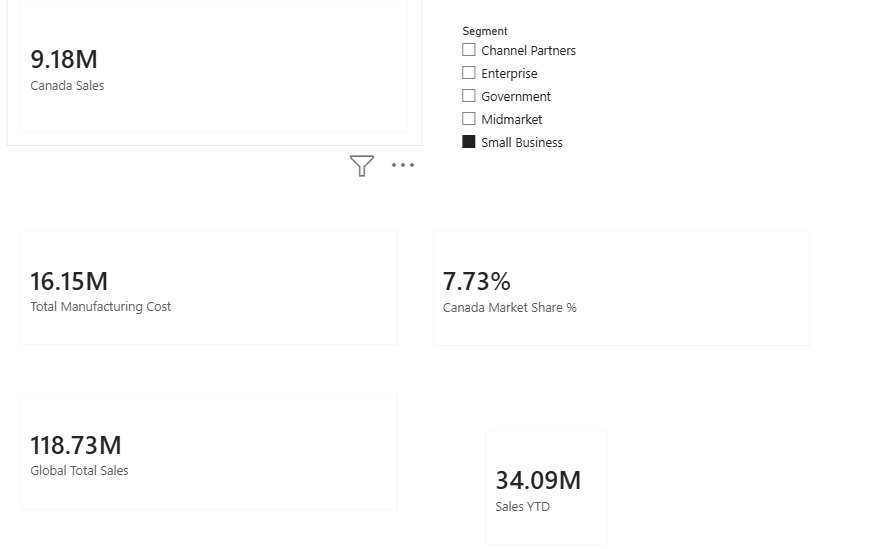

# Financial-Analysis
Project Title: Financial Performance & Market Dynamics Dashboard
Executive Summary
This Power BI project provides senior leadership with a dynamic financial overview of global sales performance. The dashboard isolates regional market share, calculates baseline manufacturing expenses, and delivers automated year-to-date tracking to monitor corporate growth targets.
Technical DAX Implementation
To answer specific business questions, I built custom Data Analysis Expressions (DAX) metrics rather than relying on default implicit fields:
Advanced Context Filtering (CALCULATE): Isolated revenue specifically for the Canadian market using strict evaluation context modification.
Row-by-Row Iteration (SUMX): Evaluated transactional item variables dynamically across mismatched data fields to compute precise manufacturing overheads.
Filter Suppression (ALL): Bypassed report visual coordinates to construct an unalterable global baseline denominator for relative share comparisons.
Safe Mathematical Execution (DIVIDE): Standardized calculation ratios to protect end-user graphics from unexpected data errors or null inputs.
Time Intelligence (TOTALYTD): Established sequential cumulative sales metrics to evaluate organizational growth velocity.

